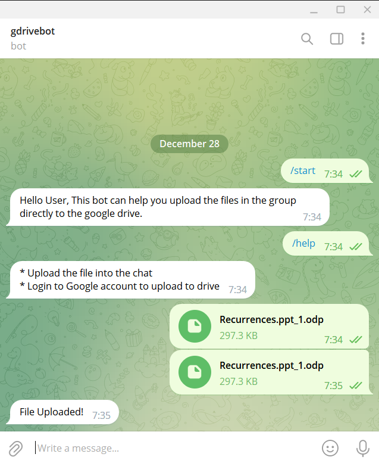

# Gdrive-TelegramBot

## About The App
A telegram bot which sends files sent to it, into your personal google drive.

## Screenshots



## Technologies
Used the Python, Google drive api and python-telgram-bot package.

## To self host the bot
- To get a local copy of the code, clone it using git :
```
git clone https://github.com/AshwinC8/Gdrive-TelegramBot.git
cd Gdrive-TelegramBot
```

- Install Dependencies
```
pip install -r requirements.txt
```

- To get google drive api credentials 
  - to setup google drive api follow the instructions given in the link below
  - https://developers.google.com/drive/api/quickstart/python
- To get Bot token 
  - Go to BotFather in telegram
  - Create a new bot
  - Copy its bot token and paste it into config.py.
